# Tests
*Created by Hans-Marius Øverås, Magne Tenstad and Erlend Skaaden*

> This article describes four test cases for our alarm program. We have chosen the test cases to highlight behavior that is difficult to predict, and to learn more about how common libraries, C and the operating system handle different situations.

## 1. Scheduling an alarm for the spring equinox

### Test instructions

1. Open the program.
2. Type `s` to select schedule. Press enter.
3. Type `2022-03-20 16:33`. Press enter.
4. Press enter to continue.
5. Type `l` and press to verify that the alarm was saved.
6. Press enter to go back to the main menu.

### Expected behavior

1. You should see the main menu, telling you the current time and the different available commands.
2. You should be prompted for a date and time.
3. You should receive a message that the alarm was scheduled.
4. You should come back to the main menu.
5. You should see one alarm listed as `Alarm 0`, and a notification that you have `1 alarm(s)`
6. You should see the main menu

### Observed behavior

> 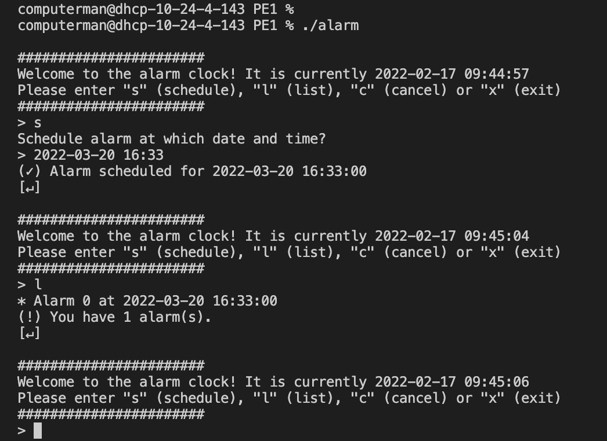

The program behaves exactly as described.

## 2. Scheduling the max amount of alarms

### Test instructions

1. Open the program.
2. Type `l` to list all alarms, verify you have 0 alarms. Press enter.
3. Type `s` to select schedule. Press enter.
4. Enter `2023` and press enter to set an alarm at the beginning of the year 2023.
5. Press enter to continue.
6. Repeat steps 3-5 11 times. The 11th time should fail.
7. Type `c` to cancel one of your alarms. You will see a list of the currently scheduled alarms.
8. Press enter and type 0 to cancel the first alarm. Press enter.
9. Do steps 3-5 once more.
10. Do step 2 to verify that you now have 10 alarms.

### Expected behavior

1. You should see the main menu.
2. You should see all the alarms.
3. Same as in the first test.
4. Same as in the first test.
5. Same as in the first test.
6. The 11th time, you should receive a message that the alarm was not set because there was no free space for alarms.
7. You should see a list of alarms.
8. You should receive a message that the alarm was canceled.
9. The alarm should be set correctly.
10. You should see 10 alarms in the listing.

### Observed behavior

> 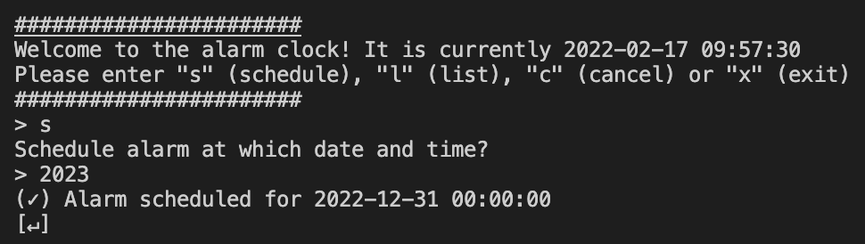
Setting an alarm, this is done 11 times.
> 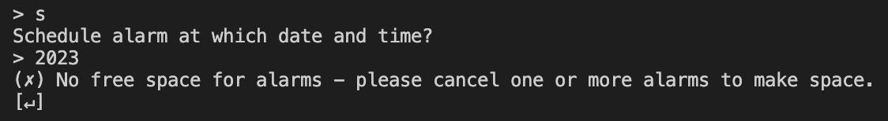
The 11th time, setting an alarm fails.
> 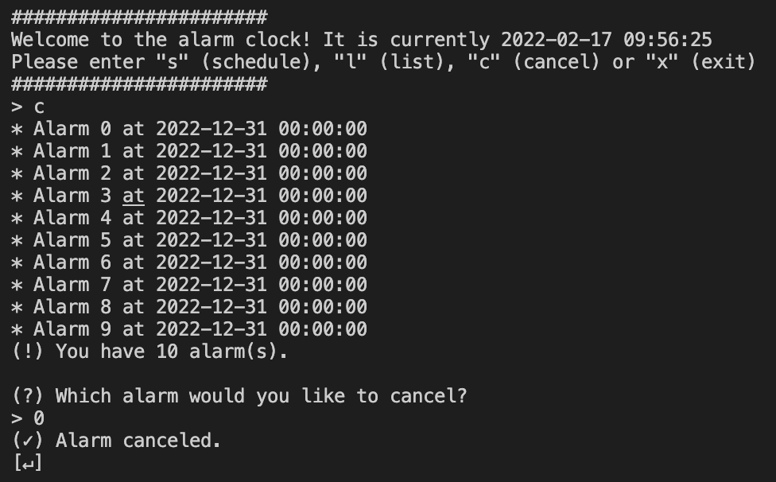
Successfully cancelling an alarm.

The program behaves exactly as described.

## 3. Alarm plays sound

### Test instructions

1. Set the alarm like in the first test, but this time set it one minute from now.
2. When the alarm is supposed to ring, run the command `ps x | grep -Eiw (alarm|screen|mpg123)` using a different terminal window.
3. After the alarm sound has finished playing, run the same command again.
4. Type the `l`-command into the program and press enter. Do this twice.
5. Repeat step 2.

### Expected behavior

1. Like in the first test.
2. Output should show the main alarm process a screen-window, the mpg123 audio player and the zombie alarm process.
3. Output should now only show the main alarm process zombie alarm process
4. The first listing should show the now raised alarm, because it has not yet been deleted. Executing the command (actually, any command) will catch the zombie and remove the alarm from the array. The second listing should therefore show no alarms.
5. Now, only the main alarm process should be shown.

### Observed behavior.

> 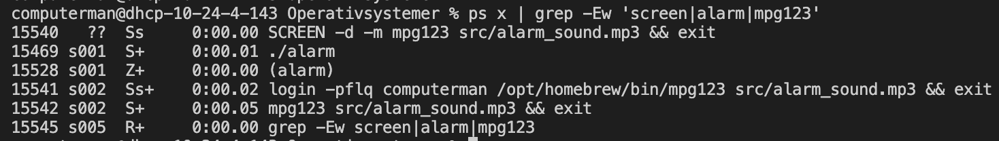
Output from `ps` when the alarm sound is playing.
> 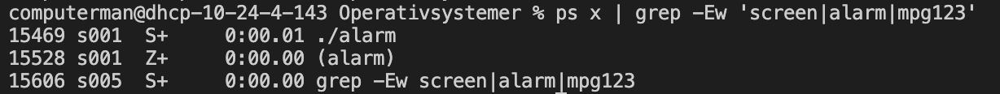
Output from `ps` when the alarm sound has finished playing.
> 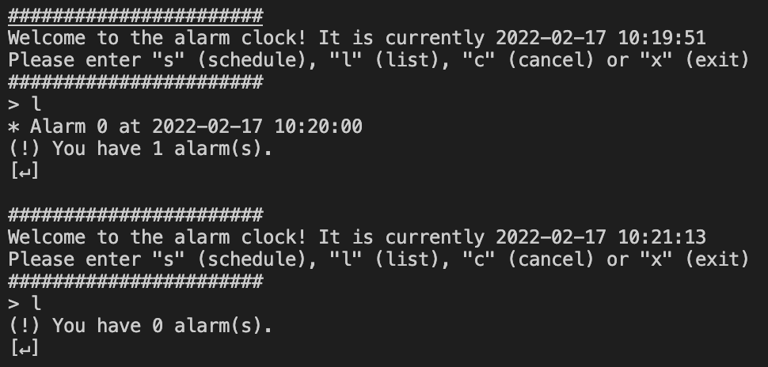
Output from the list command.
> 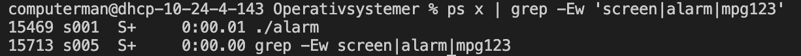
Final output from `ps`, showing the zombie removed.

The program behaves close to what was expected. In addition to displaying the mentioned processes, the `ps` command also shows itself because of the grep containing its own matching phrases. It might seem erroneous that the alarm shows up on the first listing. It would be optimal that the alarm is not shown in this case, but we decided against attempting to implement asynchronous waiting. As mentioned above, child processes are waited for after entering any command into the program.

Additionally, it seems that the `screen` command runs `login` with the flags `-pflq`. This is likely because screen needs to detach itself from the current terminal window (to prevent it from taking over the terminal session) and so it has to log in to a different terminal.

## 4. Testing invalid commands and dates

### Test instructions

1. Open the program.
2. Type 95 `s`in the input field and press enter. Type 2023, then press enter twice.
3. Type 101 `s` in the input field and press enter. Press enter.
4. Type `s`, press enter and type the date `2022-03-32 25:62` into the input field. Press enter twice.
5. Type `s`, press enter and type the date `1999-03-03 12:00` into the input field. Press enter twice.
6. Type `s`, press enter and type `lotus` into the input field. Press enter twice.

### Expected behavior

1. Same as in other tests.
2. The command `schedule` should be correctly executed and you should be able to set an alarm.
3. The buffer takes in 100 characters, so the 101th character should stay in the input buffer and automatically be entered as a date. A error message for invalid date should be recieved.
4. The date is accepted, but is saved as a different, valid date.
5. An error message is displayed, stating that this date is in the past.
6. An error message is displayed, stating that this is not a date.

### Observed behavior

> 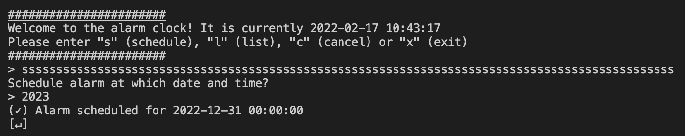
Command correctly executes, and the 95 characters are interpreted as a single `s`. (the first one)
> 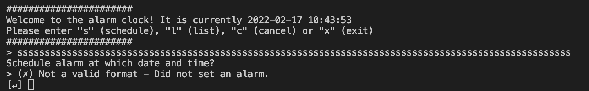
Only the first 100 characters in the input buffer are absorbed, and the final characters are entered as a date.
> 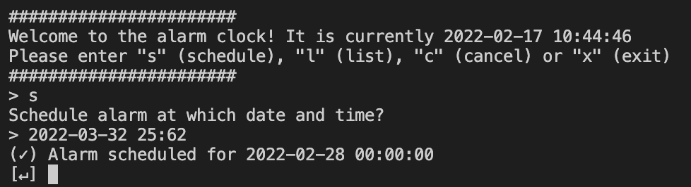
The date is accepted, but the scheduled alarm is for February 28th. We believe that any day over 31 is changed to 0, which means this alarm is scheduled for March 0th, which would be February 28th. The same applies to the hours and minutes, 25 and 62 are both invalid and therefore changed to 0.
> 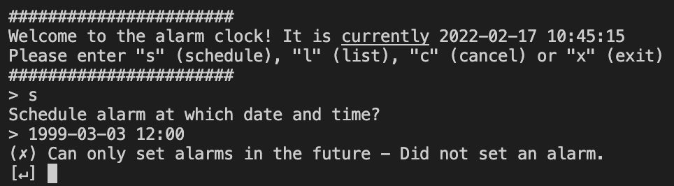
1999 is in the past and the alarm is not set.
> 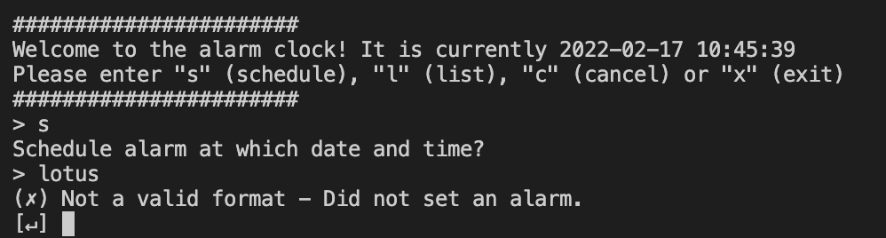
Lotus is not a valid date format at all, and the alarm is not set.

While some of the behavior can be interpreted as strange and unpredictable, we had foreseen this and as such the program behaved as we expected.